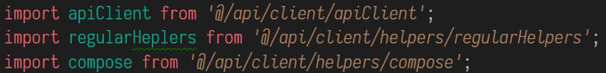

## Архитектура

**Связанность**

- модель и переходы
  > связанность абстракций

  > «Компьютер — это конечный автомат. Потоковое программирование нужно тем, кто не умеет программировать конечные автоматы» Алан Кокс, [прим](https://habr.com/post/336498/
). Википедия

  > **всё** есть модели и переходы между ними (КА). Переходы - техническая реализация, модель - абстракция над данными и их состоянием. Переходы **не**возможны без модели, модель возможна без переходов - модель первостепеннее, важнее.

  > модель может и должна быть объявлена полностью на фазе инициализации - это еще одна возможность повысить читаемость кода.
  - модель приложения
    - внутреннее представление
      > нормализация
    - view
      > DOM дерево
    - интерфейсы к бекенду / библиотекам
      > проблема в том что модель промежуточного интерфейса, обычно, можно выявить только прочитав и полностью поняв код. С решением этой проблемы может помочь статическая типизация, JSDoc или контрактное программирование.
  - переходы
    > могут быть описаны как угодно, особенно в мультипарадигменном ЯП - это порождает невероятную вариативность - стандартизация решений меньше - непонимания больше. Соответственно для упрощения понимания переходов, необходимо выбрать и стандартизировать парадигму программирования. Но это только часть решения, т.к. нет идеальных парадигм.

    > От бизнеса изменения БЛ приходят чаще, чем изменения модели, поэтому модель, как долгострой, важнее в ее проработке. Переходы же - это всегда каша, их улучшения [так же важны, но] второстепенны.

    > про важные мелочи подробнее в главе про семантику
- шина
  > стандартизация интерфейсов (связанности) переходов

  > позволяет всем сервисам договорится об использовании одного интерфейса - схемы взаимодействия между друг другом

  > выгоду подсчитать просто: количество разновидностей коннектов в шине от сервисов растет линейно, количество разновидностей коннектов между сервисами без шины растет в степенной зависимости
  <!-- TODO: шина событий VS синхронная шина -->
- структура
  > физическая связанность

## Структура

- Структура проекта
  - feature-based разделение VS technology-based разделение
  - фрактальная VS глобальная
  - нормализация VS иерархия
    > иерархическия связи нагляднее, при нормализации связанные ключи приходится держать в голове.
  > Хорошие примеры структуры - [Атомарный дизайн (Atomic Design)](https://medium.com/атомарный-дизайн/atomic-design-foreword-4960ad17bc1a), [Feature Slices](https://t.me/feature_slices)
- Структура компонента
  - должна быть последовательной, емкой, читаемой
    - семантика расположения блоков кода, объявления переменных
  > пример [стандарта](https://github.com/artalar/blog/blob/master/src/pages/react-component-structure.md)


## Семантика


Под семантикой в языке подразумевается **смысловое значение**, т.е. наличие семантики - это наличие явности выражения мысли. Попросту - читаемость кода.

Главный слоган семантики - **явное лучше не явного**.

- null VS undefined. В чем проблема этого кода `var obj = { list: undefined }; newObj = copyObj(obj); if(newObj.list !== undefined) newObj.list.push()`?
  > maybe VS optional

  > null - это намеренно пустое значение. undefined - это неожиданно пустое значение, подсказка-хелпер рантайм мира, которой в статически-типизированных ЯП не бывает (там undefined == TypeError). Поэтому никогда не используйте undefined нарочно - это целенаправленное запутывание кода. Например: `var obj = { list: undefined }; newObj = copyObj(obj); if(newObj.list !== undefined) newObj.list.push()` - в чем проблема этого кода? Если в `copyObj` будет ошибка из-за которой `list` удаляется или теряется - мы об этом не узнаем, потому что в данном коде undefined отвечает и за предсказуемое и за непредсказуемое поведение. Если бы в `obj.list` по умолчанию использовался бы null, в проверке `newObj.list !== null` мы бы получили `true` и далее, если в `copyObj` была ошибка и свойство потерялось, то на `list.push()` - код бы упал и ошибку было бы проще найти, чем если бы, при использовании undefined `list.push()` вообще не отработал и ошибки не явным образом уже бы проявились уже в самом приложении.

  > Кто-то может заметить, что проверку можно было бы делать более явную `if(Array.isArray(newObj.list)`, но в этом случае, если бы в `newObj.list` находилось, по ошибке, что-то кроме массива и null (которые ожидаются), то дальнейшую ошибку в работе самого приложения было бы дебажить сложнее. С другой стороны проверка `newObj.list !== null` не дает нам никакого представления о том что находится внутри свойства `list` (оно могло бы и по другому называться), поэтому не использование строгой проверки на массив так же является плохой практикой. Эта проблема решается использованием статической типизации или контрактного программирования.
- Переполнота данных.
  > Задействуйте в коде только используемые части модели. `<Component {...restProps} />` - антипатерн.
- Порядок смысловых конструкций кода `bigArray.filter(some => some === this.props.v)` VS `const { v } = this.props; bigArray.filter(some => some === v)`.
  > Показательным примером важности семантики расстановки блоков кода являются новые хуки в React.js<!-- https://twitter.com/threepointone/status/1056594421079261185 -->.
- Proxy, get, set
  > Proxy, get и set - реализуют паттерн "заместитель", при котором возможно перехватить обращение к свойствам целевого объекта для выполнения какой-то дополнительной логики. Проблема этого паттерна в том что он воздействует на поведение программы, но это [воздействие] никак не отражается визуально для программиста. Т.е. говоря о семантике - в этом паттерне она просто отсутствует.

  > Сравните еще раз этот код `bigArray.filter(some => some === this.props.v)` VS `const { v } = this.props; bigArray.filter(some => some === v)`. С функциональной точки зрения разницы в нем нет, но `props` обернут в прокси, то каждый вызов `v` будет "утяжелен" перехватчиком, поэтому у этого, казалось бы, одинакового кода может быть совершенно различная производительность.

  > Если в проекте используются прокси или геттеры и сеттеры, то в любой случайной точке кодовой базы никогда нельзя быть до конца уверенным есть здесь они или нет. Это невидимый контекст, что бы узнать о котором иногда, особенно в больших проектах, требуется исследовать большое количество связанного кода. Таким образом приходится либо постоянно быть не уверенным в читаемом коде, либо производить его многочисленные инспекции. Решением этой проблемы может быть использование паттерна "декоратор", или любое явное использование контекста и зависимостей.
- JSX VS JS
  > JSX семантически это верстка, он отвечает за то ***что*** будет отображаться, а не ***как***, потому что его задача именно в инкапсуляции логики `document.createElement`. Результат JSX, как и результат самого HTML всегда должен быть статичен, в независимости от данных. В подтверждение этому выступает апи хуков жизненного цикла - оно описывается в JS - это наглядно.

  > Например, `react-router` является примером очень плохого апи, т.к. через компонент `<Switch>` он предлагает описывать логику зависимостей от данных прямо в JSX (более того, сам элемент превращается в управляющий блок) - при этом семантика полностью рушится, что ведет к ментальному усложнению чтения кода - в голове нужно держать больше контекста. Правильнее в JS (в начале блока функционального компонента или метода `render`) описывать все зависимости - высчитывать их и потом в конечный возвращаемый JSX вставлять все необходимое: `title = predicate ? 'first' : 'second'; return <span>{title}</span>` - это и есть декларативное описание.

  > Желание описать роутинг (или что угодно еще, есть даже библиотека с компонентами `<If>`, `<For>`) декларативно - понятно, т.к. это кажется нагляднее и проще (хотя не все так просто, потому что `пониманиеАбстракции = время(документация)`). Но нужно понимать, что декларативное описание не обязано иметь единственный синтаксис \ шаблон. JSX - это декларативный синтаксис к описанию биндинга модели приложения на DOM, и это означает что его **не** нужно использовать для декларативного описания конструкций, которые не относятся к DOM напрямую. Для написания декларативного кода можно использовать, например, библиотеку [Ramda](https://ramdajs.com), писать [макросы](https://github.com/kentcdodds/babel-plugin-macros) и много другое.

  > "render-props" через `children` - это наглядный пример антипатерна семантики. Да, сам подход хорошо решает технические проблемы, но сильно ухудшает читаемость кода. Решением может быть использование [сведение](https://github.com/pedronauck/react-adopt) render-prop'ов

  > Плохие советы по рендер-пропам дают даже [css-tricks](https://css-tricks.com/an-overview-of-render-props-in-react/) 

  > P.S. вместо `react-router` я рекомендую использовать что-то вроде `redux-first-router`.

## Прикладные советы

- `export default` только для top-level
  - явная связанность
  - проще поиск
  - проще рефакторить
    <!-- > TODO: src\api\client\helpers\compose.js -->
  - только для функционального DI (если нужно получить аргументы из одного уровня в другой)
  - выносите в отдельные компоненты: меньшая связанность, легче испектировать в реакт-девтулзах
  > 
- Техника render-props - это метод функциональной инъекции зависимостей, соответственно ее так и нужно использовать
  > исполнитель не должен знать что в рендер-пропе, он должен только передавать то что знает о себе
- Берите готовые сборки
  - CRA
  - Next.js
    > redux больше фреймворк, чем некст
- **No** Hype Driven Development
  > Берите только те библиотеки в которых чувствуете нужду (обоснованную). Например, редко кому действительно нужны форм-менеджеры, часто проще и гибче писать все руками, попробуйте - это простые фабрики.

  > Напишите сервисный проект на 1-2 месяца на новом стеке - это будет полезнее и дешевле, чем знакомится с ним в продакшене.

### Обработка ошибок

- Если вы останавливаете прерывание, всегда используйте `setTimeout`.
- Используйте `window.onerror` для логирования.
- Есть несколько классов (типов) `Error`, от них можно наследоваться - создание собственных ошибок потом поможет в их обработке с `instanceof`.
- Модифицируйте `message` - делайте его информативнее, добавляйте название фичи (бизнес-сущности), в которой был осуществлен перехват ошибки.
- Используйте блок `finaly`.

```javascript
class FeatureError extends Error { constructor(message) {

  if (typeof message === 'string') return super(message)

  super('@@FeatureName: error!\nSee error data in `data` property of this Error instance')
  this.data = message

} }

try { throw /* */ } catch (e) {

  const error = e instanceof Error ? e : new OwnError(e)

  setTimeout(() => { throw error })
}
```

### Devtools


- react-devtools
  - [profiler](https://reactjs.org/blog/2018/09/10/introducing-the-react-profiler.html)
- redux-devtools
  - научите пользоваться снапшотами тестировщиков - это сильно упростит их задачу
- [kuker](https://github.com/krasimir/kuker)
- debugger в IDE - это очень удобно: реальные данные выводяться прямо из переменной
- Шарьте основные элементы приложения в window в дев сборке

### Автоматические проверки и инструменты

- Статическая проверка типов: flow, TS, ReasonML, ClojureScript, Kotlin, Elm, Dart...
- Контракты, особенно для любого внешнего API (сеть, библиотеки).
- Babel-[macros](https://github.com/kentcdodds/babel-plugin-macros)
- eslint, stylelint, commitlint. Пишите свои плагины.
- editorconfig.
- Тесты. Освойте pupettier.
- prettier.
- ?codmod.
- `TODO:` и `FIXME:` и их подсветка в IDE. Мб линтер на ПР в мастер.

### Документирование

> Вы не умеете писать самодокументированный код - это не ваша вина, просто это правда тяжело.

- README.md
  - общее описание бизнес-цели проекта
  - ссылки на основные ресурсы: git, jira (backlog, sprint, готовые фильтры под это)
  - список сред (дев, стейдж, тест, прод) и прав доступа к ним
  - ссылки на контакты ключевых ответственных лиц в проекте
    - ПМ, техлид (бек и фронт), тимлид (бек и фронт), тестировщик, дизайнер, девопс, сетевик
    - их почты, телефоны, чаты
- CONTRIBUTING.md
  - инструкция по настройке инфраструктуры, среды
  - общие правила и их выражения в конфигах линтеров
  - gitflow
  - правила ревью кода
- CODE_OF_CONDUCT.md
  - принятые архитектурные паттерны
  - структура файла
  - структура модуля / проекта
- CHANGELOG.md
  - описание легаси, например, все частично используемое (перешли на новую технологию, но не выпилили старую)
- описывайте код: не то что он делает (это и так ясно из самого кода), а какую задачу он решает: оставляйте ссылки на issue, ведите чейджлог. Для каждой фичи \ организма можно вести свой readme.md
- пишите блок-схемы - это бывает очень эффективно

## Ссылки на материалы
- [Исходный код презентации](https://github.com/artalar/blog/blob/master/src/pages/lost-chapters-of-frontend-book.md)
- 