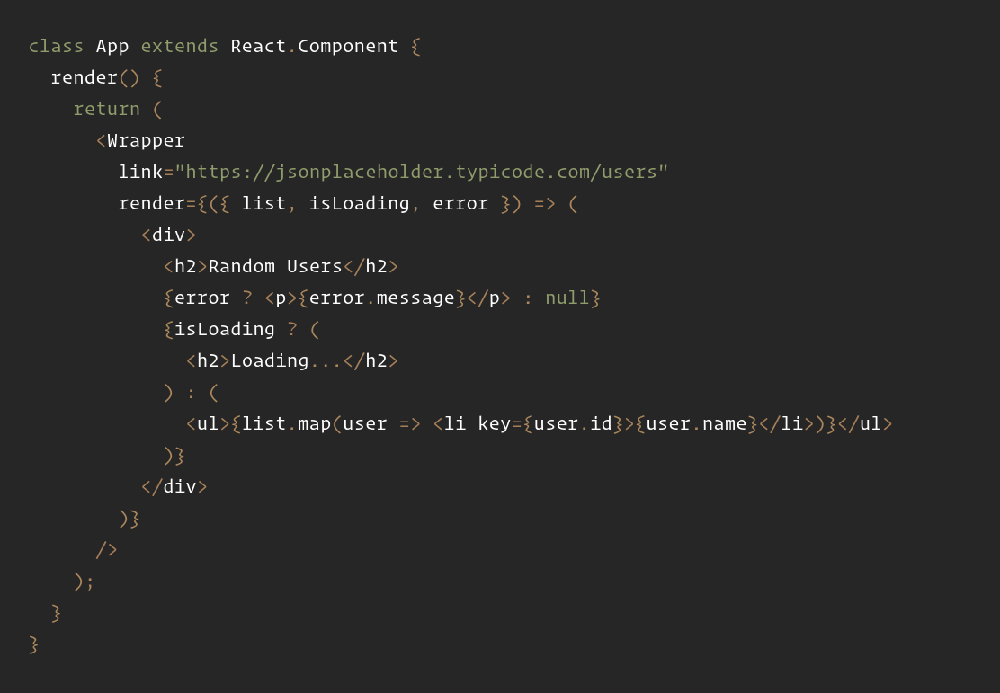

<!--
Обо мне.
5+ лет в ИТ, 2+ года во фронтенде, CSSSR.
Название.
Семантика в программировании или явность кода на примерах JS и JSX.
Описание.
Всем известно что одну задачу, в большинстве своем, можно решить (запрограммировать) несколькими способами. Каждый из способов может отличаться архитектурой, разнообразными паттернами, а так же кодстайлом, о котором и пойдет речь в моем докладе. Я расскажу не просто про форматирование кода, в стиле выбора максимальной длины строки, а про архитектурные и прикладные советы, которые помогут в написании явного, понятного, дешевого (т.е. поддерживаемого) кода.
(для ПК) Темы: семантические особенности JS и JSX, линтеры, декларативное программирование, структура проекта. Частично я уже затрагивал некоторые темы в своем предыдущем докладе: https://youtu.be/dCXvQkvSyQg?list=LLi6V1J5WfpPasQWskawcnVg&t=1663

- [Лекция 22: Формальная семантика языков функционального программирования](https://www.intuit.ru/studies/courses/471/327/lecture/7975?page=1)
- payload http://s.csssr.ru/U8SMMLH99/20190301205828.png
- https://habr.com/ru/company/oleg-bunin/blog/433326/
- [Языки программирования, синтаксис, семантика, прагматика](https://youtu.be/FtSWlpKuOKI)
- По поводу роутинга: завязываться на cdm - хардкодить БЛ в view
- https://medium.com/@stasonmars/5-советов-как-лучше-писать-условные-конструкции-в-javascript-236b31ecf299
- http://s.csssr.ru/U8SMMLH99/20190307175038.png
- http://s.csssr.ru/U8SMMLH99/20190307175130.png
- https://gist.github.com/artalar/6de0d1778bb62634214b69dbcb7090cb
- https://gist.github.com/8f6e9c2e1992fae55a23ad8ce8938d37
- как писать JSX? Представьте что это шаблон!
- [Моё разочарование в софте](https://habr.com/ru/post/423889/)
- https://multiparty.org/carousels/
- [Разница в семантике классов и хуков в React.js](https://twitter.com/threepointone/status/1056594421079261185)
- [Краткий пересказ утерянных глав руководства по фронтенду](https://docs.google.com/presentation/d/1-TI4ozHLV7IhujcmAsNkf58RBdrKQB37EUKtQ0UYmIM/)
-->

# Семантика в программировании или явность кода на примерах JS и JSX.

## Введение

Мотивацией к написанию данного материала послужил внутренний дискомфорт от чтения чужого кода. Какие-то конструкции кажутся избыточными или излишне сложными, какие-то вообще ошибочными. Сложно понять какую бизнес-задачу пытался решить автор и, в частности, какие особенности языка или стека ему в этом мешали. Опытные программисты знают, что и свой код спустя некоторое время становится малопонятным. Кажется, эта самая понятность исходит из контекстов: продукта, проекта, стека (фреймворки, библиотеки), команды и принятых соглашений по кодстайлу и архитектуре. С этим ничего не сделаешь, просто приходится вновь погружаться во все эти контексты и искать связи между ними - только тогда каждая конструкция в коде обрастает понятной мотивацией и желание все переписать стихает.

Но, бывает, можно натолкнуться на чужой совершенно неизвестный код, который выглядит лаконичным и понятным. Сразу ясно какую задачу он решает и как. Причем такой код может быть даже на другом языке программирования или с использованием неизвестного стека, но, почему-то, он нормально читается, интуитивно рассказывая свою историю.

Вот и задаешься вопросом, есть ли, все же, какие-то универсальные правила построения и структурирования кода, которые бы не зависели от конкретного языка программирования или стека? Можно попробовать найти ответ на этот вопрос копнув в самую глубь, попробовав понять что такое язык программирования в общем и какие он может иметь обобщенные особенности из  которых можно вывести правила лучших практик.

> Хочется найти универсальную концепцию решения проблемы понимания кода. Т.е. выработать базовые / главные правила идеального кодстайла. Универсальную - т.е. фундаментальную, как это делают JSX и GraphQL в своей области.

## Декларативность

> TODO:
> - метапрограммирование
> - примеры библиотек для декларативного описания кода, babel-macro

<!--
Императивное программирование предполагает описывать инструкции и их последовательные связи с использованием низкоуровневых (в рамках языка программирования) выражений.
Как можно понять, все операторы выражения — в действительности задекларированные языком программирования инструкция. Но каждая инструкция - это описание какого-то выражения. Таким образом императивное и декларативное программирование - это условности глубины абстракции и контекста рассматриваемого кода программы.
-->

Многие называют "декларативное" программирование панацеей понятности и читаемости, но так ли это на самом деле? Почему кто-то с этим согласен на все 100%, а кто-то совершенно не разделяет энтузиазма по этому поводу? Как может панацея для кого-то быть не панацеей - это безсмыслица. Нужно разобраться.

Все, наверное, слышали чем декларативное программирование отличается от императивного: декларативное описывает **что** нужно сделать, а императивное **как** нужно сделать. Но говоря об этом обязательно стоит помнить, что при декларациях того что нужно сделать идет оперирование какими-то **существующими** элементами, о которых мы знаем **как** они работают (иначе наши декларации ничего бы не стоили). Декларативное программирование — это способ описания программы через набор **верхнеуровневых** инструкций, детали реализации и исполнения которых скрыты за исполнителем этих инструкций. Под исполнителем могут подразумеваться: функции высшего порядка (ramda, react, redux-saga), макросы (JSX) в случае кодогенерации, JIT компилятор в случае исполнения (синтаксис ЯП). Т.е. средство описания [деклараций] всегда имеет какой-то контекст и "декларативность" означает не какой-то конкретный паттерн, а текущий уровень восприятия глубины абстракции разработчиком.

Например, классическим примером декларативного программирования является код в функциональном стиле:
> ```js
> array.filter(predicate)
> ```
Но что можно сказать про такой код:
> ```js
> instruction = { type: 'filter', target: array, arguments: [predicate] }
> ```
Этот код более декларативен - в нем нет прямого вызова функций, а только описание того что нужно сделать. Но как такое может быть, есть градации декларативности? А лучше ли этот код в плане читаемости и понимаемости? Кажется ответ не совсем однозначный.

Так же можно рассмотреть классический "императивный" код:
> ```js
> for (let i = 0; i < array.length; i++) if (predicate(array[i])) result.push(array[i])
> ```
Он кажется более сложным, чем приведенные снипеты выше, но если посмотреть на результирующий машинный код, то код с `for` и `if` покажется вполне простым и декларативным, т.к. он скрывает то **как** работать с памятью.

Из всего этого можно сделать простой вывод, "декларативность" - это термин для определения уровня абстракции, который для каждого человека может быть разным, в зависимости от контекста.

Как-то на ревью ПР на работе я увидел неудачное использование функционального подхода в написании определенного набора действий и переписал этот код на "императивщину" (https://gist.github.com/artalar/6de0d1778bb62634214b69dbcb7090cb). Спрашивая коллег многие высказывались за то что функциональный код выглядел лучше, тогда я устроил голосование в чате. Как же было интересно узнать что мнение разделилось ровно поровну и кому-то был понятнее функциональный подход, а кому-то императивный:


За функциональный подход выступало большое количество людей и многие из них были разработчиками с большим опытом - им хотелось доверять, но при этом результаты голосования показывали что не все так однозначно. В действительности те кто имел опыт и привык работать с библиотеками в функциональном стиле просто привыкли к такому паттерну и образу мышления, но это не означает что он является единственно верным.

И функциональный и императивный код выполняют одну и ту же работу и дают один и тот же результат, но совершенно по разному читается, воспринимается и даже исполняется в JIT. Проще говоря - имеют разную семантику.

## Проблемы

### `null` VS `undefined`

**null** - это намеренно пустое значение. **undefined** - это неожиданно пустое значение, подсказка-хелпер рантайм мира, которой в статически-типизированных ЯП не бывает (там undefined == TypeError).

С интуитивной точки зрения, поверхностного взгляда, и null и undefined означают пустое значение и имеют одно и тоже поведение, но семантически это разные конструкции, что проявляется в мелочах. Например, если выражение `obj.prop === null` верно можно быть уверенным что свойство `prop` целенаправленно установлено в объекте где-то в предыдущем исполнении кода. Но если выражение `obj.prop === undefined` верно, то нет никаких гарантий что свойство `prop` вообще есть в объекте, с null такой проблемы нет.

<!-- FIXME: заменить название -->
### Cсылочная прозрачность

```js
// [1]
setTimeout(f, 0, arg)
// [2]
setTimeout(() => f(arg), 0)
```

Два небольших снипета кода, приведенных выше, с точки зрения постановки задачи одинаковые. Однако фактически они различаются и интересно то на что это может повлиять. Строго говоря у второго варианта отсутствует ссылочная прозрачность - колбек который будет выполнен зависит от переменной, которая может быть изменена после инициализации таймаута, но до выполнения колбека, в первом варианте это невозможно, т.к. аргумент передается по ссылке, а не через переменную замыкания.

Это очень хороший пример что такое семантика и зачем она нужна. Семантика часто отвечает за контекст или множество контекстов, которые могут касаться рассматриваемого кода: в зависимости от используемых синтаксических конструкций ЯП и API библиотек может быть очень много особенностей и "подводных камней", которые не понятны, если не проанализировать всю семантику - все, с формальной точки зрения, особенности. Из этого просто сделать вывод что тот код проще (читать, понимать, прогнозировать поведение), у которого семантика меньше. Это общее правило и вывод данного материала - нужно стараться сводить семантику на нет или постоянно помнить ее и учитывать, что бы было проще разрабатывать и читать код. 

### Паттерн "заместитель"

```js
function include(array, target) {
  for (let i = 0; i < array.length; i++) {
    if (array[i] === target) return true;
  }
  return false;
}
```
VS
```js
function include(array, target) {
  for (const element of array) {
    if (element === target) return true;
  }
  return false;
}
```

Proxy, get и set - реализуют паттерн "заместитель", при котором возможно перехватить обращение к свойствам целевого объекта для выполнения какой-то дополнительной логики. Проблема этого паттерна в том что он воздействует на поведение программы, но это [воздействие] никак не отражается визуально для программиста. Т.е. говоря о семантике - в этом паттерне она просто отсутствует.

Сравните еще раз этот код `bigArray.filter(some => some === this.props.v)` VS `const { v } = this.props; bigArray.filter(some => some === v)`. С функциональной точки зрения разницы в нем нет, но `props` обернут в прокси, то каждый вызов `v` будет "утяжелен" перехватчиком, поэтому у этого, казалось бы, одинакового кода может быть совершенно различная производительность.

Если в проекте используются прокси или геттеры и сеттеры, то в любой случайной точке кодовой базы никогда нельзя быть до конца уверенным есть здесь они или нет. Это невидимый контекст, что бы узнать о котором иногда, особенно в больших проектах, требуется исследовать большое количество связанного кода. Таким образом приходится либо постоянно быть не уверенным в читаемом коде, либо производить его многочисленные инспекции. Решением этой проблемы может быть использование паттерна "декоратор", или любое явное использование контекста и зависимостей.

### JSX VS JS

> JSX должен быть в JS, а не JS в JSX. Top level синтаксис в файле - это JS, сам JSX пишется только пежду открывающим и закрывающим тегом, соответственно там необходимо иметь минимум JS.

JSX семантически это верстка, он отвечает за то ***что*** будет отображаться, а не ***как***, потому что его задача именно в инкапсуляции логики `document.createElement`. Результат JSX, как и результат самого HTML всегда должен быть статичен, в независимости от данных. В подтверждение этому выступает апи хуков жизненного цикла - оно описывается в JS - это наглядно.

Например, `react-router` является примером очень плохого апи, т.к. через компонент `<Switch>` он предлагает описывать логику зависимостей от данных прямо в JSX (более того, сам элемент превращается в управляющий блок) - при этом семантика полностью рушится, что ведет к ментальному усложнению чтения кода - в голове нужно держать больше контекста. Правильнее в JS (в начале блока функционального компонента или метода `render`) описывать все зависимости - высчитывать их и потом в конечный возвращаемый JSX вставлять все необходимое: `title = predicate ? 'first' : 'second'; return <span>{title}</span>` - это и есть декларативное описание.

Желание описать роутинг (или что угодно еще, есть даже библиотека с компонентами `<If>`, `<For>`) декларативно - понятно, т.к. это кажется нагляднее и проще (хотя не все так просто, потому что `пониманиеАбстракции = время(документация)`). Но нужно понимать, что декларативное описание не обязано иметь единственный синтаксис \ шаблон. JSX - это декларативный синтаксис к описанию биндинга модели приложения на DOM, и это означает что его **не** нужно использовать для декларативного описания конструкций, которые не относятся к DOM напрямую. Для написания декларативного кода можно использовать, например, библиотеку [Ramda](https://ramdajs.com), писать [макросы](https://github.com/kentcdodds/babel-plugin-macros) и много другое.

"render-props" через `children` - это наглядный пример антипатерна семантики. Да, сам подход хорошо решает технические проблемы, но сильно ухудшает читаемость кода. Решением может быть использование [сведение](https://github.com/pedronauck/react-adopt) render-prop'ов

Плохие советы по рендер-пропам дают даже [css-tricks](https://css-tricks.com/an-overview-of-render-props-in-react/) 

P.S. вместо `react-router` я рекомендую использовать что-то вроде `redux-first-router`.

> Показательным примером важности семантики расстановки блоков кода являются новые хуки в React.js<!-- https://twitter.com/threepointone/status/1056594421079261185 -->.

## Семантика


Под семантикой в языке подразумевается **смысловое значение**, т.е. наличие семантики - это наличие явности выражения мысли. 

Если попробовать разобраться в семантике программного языка детально, то окажется что это больше относится к области компиляторов и формальному (математическому) доказательству корректности программ. Нужно попробовать описать все это вкратце и верхнеуровнево.

Машина - это большой конечный автомат, точнее конечный преобразователь (трансдьюсер). Ее инструкции - набор переходов. Человеку сложно оперировать такими понятиями, особенно в большой программе, он в принципе мыслит иначе, для [быстрого] понимания чего-то часто применяя интуицию.

<!--
> - Эволюция ЯП в улучшении абстракций: машинные коды, переменные (асемблер), процедуры и условные переходы (фортран), структуры (алгол68, паскаль), ООП, функции высшего порядка и развитые системы типов.
> - Но чем выше уровень абстракции, тем больше падает эффективность программы (условно, 1 уровен абстракции вдвое понижает вычислительную производительность)
> - **Алгол68** - имел на тот момент невероятно мощную и математически доказательную систему типов, но слишком сложную в использовании.
> - **COBOL** - на нем написано невероятно много кода, который до сих пор поддерживается, но ломающая версионность делает его использование очень сложным.
> - **ПЛ/1** - ЯП со свободным синтаксисом и [уникальной] возможностью управлять точностью вычислений. В нем можно было делать слишком много (приведение разнообразных типов) и разобраться в итоговом коде было сложно.
> - "логические" языки, вроде **PROLOG** сложно назвать языками *программирования*.
> - Изначально ООП подразумевал концепцию объектов, которые просто обмениваются сообщениями
> - Будущее программирования - функциональщина
-->

**Язык** в общем и язык программирования в частности - это **синтаксис** (набор правил формализации) и **семантика** (описание семантического домена - набора функций). Синтаксис - это инструмент, а семантика - правила пользования инструментом.

Перебор возможных вариантов работы [с данными] при написании программы очень похож на формальное математическое доказательство - это называется *Соответствие Карри — Ховарда*. Но в отличии от математического доказательства написание программы заключается в том что логика построения программы строится не на формальных доказательствах, а интуитивных умозаключениях программиста, которые он уже пытается наложить на формальные правила ЯП.

Понятно что каждую задачу можно описать на ЯП по разному. Это, в частности, зависит и от личного представления программиста о задаче, от его привычек и способа мышления, умения использовать то или иное API языка, библиотек, фреймворков. Но как соотнести абстрактное представление программиста о задаче с четким и формальным алгоритмом? Есть ли какое-то правило, функция, которая описывает и представляет разницу между индивидуальным кодом программиста и формальным необходимым результатом? Да, это и называется семантика.

<!-- TODO: какая-то каша, а не описание -->

В итоге. **Семантика позволяет конкретизировать до формального уровня интуитивное представление кода программы**. Иначе говоря "с первого взгляда" код может иметь одну логику поведения, но учитывая семантику можно "увидеть" дополнительные аспекты \ ветвления алгоритма.

## Линтеры

> TODO:
> - Добавить ссылки на плагины проверяющие логические ошибки, разобрать их.
> - Погуглить и почитать про семантически-ориентированный линтинг.
> - Добавить рассуждения связи линтера и семантики.

Lint или линтер - это статический анализатор кода, который изначально был продуктом для языка Си, но в последствии стал нарицательным словом для обозначения подобных инструментов общего класса. Линтер - это инструмент отслеживания "не правильного" использования конструкций языка, в результате которых повышается вероятность возникновения ошибки. Он позволяет находить ошибки в коде еще до его компиляции (у JS это происходит в рантайме), чем, в итоге, упрощает и ускоряет разработку. Примеры ошибок, которые может отследить линтер: неиспользуемые переменные (предупреждение), отсутствие `default` в `switch` (логическая ошибка), повторное объявление переменных (ошибка) или свойств объекта, ошибка в конструкциях языка (пропущенный `catch` после `try`). Есть возможность отсеживания и более сложных контекстно-логических ошибок, например использование индекса элемента массива, для указания `key` компоненту, при мапинге по списку в JSX.

Так же одной из возможностей линтеров является проверка стилистики форматирования кода (отступы, переносы строк и т.п.) определенному шаблону, но это лишь побочная функция. Например, инструмент [Prettier](https://prettier.io) занимается только форматированием стилистики кода (его текста) и не производит анализ уместности конструкций языка, написанных разработчиком. Поэтому не верно утверждать, что prettier может заменить линтер или наоборот - это разные инструменты. Это же касается и систем типизации, вроде TypeScript или Flow - они осуществляют проверку совместимости операторов и выражений для разных типов данных, но не проверяют как эти операторы или выражения записаны.

Использование линтера является стандартом и необходимостью в современной разработке. Для JavaScript самым популярным линтером является [ESLint](https://eslint.org) (а [вот](https://www.npmjs.com/package/eslint-config-airbnb) самый популярный конфиг для него), хотя у него есть альтернатива - [JSHint](http://jshint.com). Так же линтеры [есть](https://stylelint.io) и для CSS.

## Структура проекта

> TODO:
> - Структура проекта как визуальное средство верхнеуровнего представления программы
