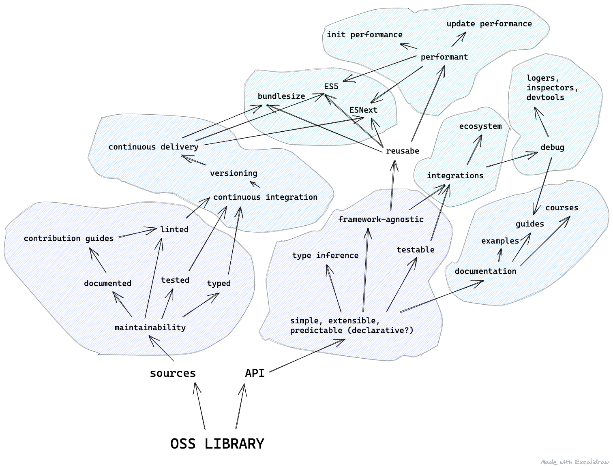
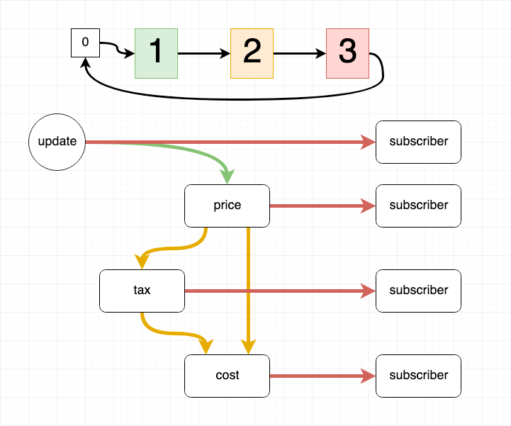
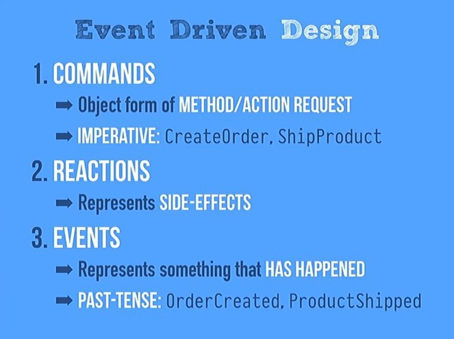
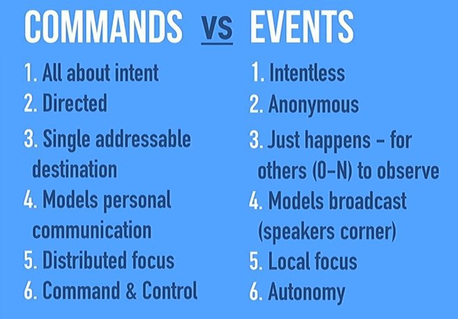

Черновик к докладу https://www.youtube.com/watch?v=N2rAQ4uC6VY

Здесь инфы больше, чем было озвучено в докладе

Но это черновик, не нужно его распространять для просвящения, он еще должен быть доработан.

- [Архитектура менеджера состояния](#архитектура-менеджера-состояния)
  - [Введение](#введение)
  - [Оговорка про библиотеки в общем](#оговорка-про-библиотеки-в-общем)
  - [Общая концепция менеджера состояния](#общая-концепция-менеджера-состояния)
  - [Реактивность](#реактивность)
    - [Reactive programming](#reactive-programming)
    - [Пример реактивного распространений данных](#пример-реактивного-распространений-данных)
    - [Недостатки реактивного программирования](#недостатки-реактивного-программирования)
  - [Данные](#данные)
    - [Information](#information)
    - [Data](#data)
    - [Cache](#cache)
    - [State](#state)
    - [Transaction](#transaction)
    - [Patch](#patch)
    - [Immutability](#immutability)
    - [Rollback](#rollback)
    - [Persistence](#persistence)
    - [Side-effect](#side-effect)
  - [Ограничения](#ограничения)
    - [Zombie (stale) dependencies](#zombie-stale-dependencies)
    - [Порядок вызова подписчиков](#порядок-вызова-подписчиков)
    - [Diamond problem](#diamond-problem)
    - [Push / pull](#push--pull)
    - [Memoization](#memoization)
  - [Контроль доступа](#контроль-доступа)
    - [Selector](#selector)
    - [Lense](#lense)
    - [Cursor](#cursor)
    - [Proxy](#proxy)
  - [Lifetime and memory leaks](#lifetime-and-memory-leaks)
    - [Cold observable](#cold-observable)
    - [Hot observable / Subject / Producer](#hot-observable--subject--producer)
    - [Warm / lazy observable](#warm--lazy-observable)
  - [Сравнение](#сравнение)

# Архитектура менеджера состояния

## Введение

Стейт менеджмент (СМ) очень многогранный подход, который позволяет обслуживать как небольшие задачи, для более детерминированного описания вычислительных процессов, так и строить целые архитектуры вокруг этого паттерна, для решения проблем зацепленности кода и автоматической оптимизации производительности вычисления комплексных потоков данных. Реализация стейт менеджера изобилует особенностями и подводными камнями, которые в зависимости от решаемой задачи могут быть актуальными или нет, в этой статье мы их и разберем.

Информация ниже - это большая часть накопленных мною данных о реактивном программировании и управлении потоками данных за последние три года, что я занимаюсь изучением и написанием менеджеров состояния. Мне это просто интересно и в этом не всегда есть практическая ценность, но один из моих OSS проектов - [Reatom](https://reatom.js.org) используется в малых и очень больших компаниях и имеет небольшое комьюнити.

## Оговорка про библиотеки в общем

Прежде всего стоит оговориться и напомнить о том что СМ, как и любая переиспользуемая библиотека, должен отвечать целому ряду требований, реализация которых совсем не тривиальна и поэтому автор библиотеки должен быть открыт к сообществу, взаимодействовать с ним и принимать помощь, заботиться о нем. А сообщество должно уважительно относиться к труду команды разработки. Бывает, что СМ не может состояться уже на этом этапе.

[](https://excalidraw.com/#json=5931117295173632,Rm4opliX6714sa19BtzuKA)

При этом, сообществу нужно здраво оценивать библиотеку и ее возможности и применять ее к месту. Стоит соотносить уровень подготовленности членов команды к концепциям, сильным и слабым сторонам предполагаемых для использования библиотек. И, самое главное, необходимо всецело оценивать нефункциональные требования к разрабатываемому продукту и помнить, что web приложения работают на клиентских устройствах, производительность которых, в отличии от бекенда, никак не может быть подконтрольна. Последний аспект один из важнейших среди всех причин использования менеджера состояния, т.к. одна из его задач - автоматическая оптимизация производительности, путем уменьшения количества излишних вычислений.

## Общая концепция менеджера состояния

Стейт менеджер, как термин, используется в индустрии для указания любой технологии, у которой существует механизм подписки на изменение данных. Т.е. базово, судя по общественному мнению, стейт менеджер выглядит так:

```js
class Store {
  constructor(initialState) {
    this.state = initialState
    this.listeners = new Set()
  }

  subscribe(listener) {
    this.listeners.add(listener)
    return function unsubscribe() {
      this.listeners.delete(listener)
    }
  }

  update(value) {
    if (this.state !== value) { // <- key feature of SM
      this.state = value
      this.listeners.forEach(listener => listener(value))
    }
  }
}
```

Но если СМ такой простой, почему в NPM их так много и почему они, порой, так сильно отличаются? Какие еще функции СМ может выполнять и зачем (почему)? Давайте разбираться.

Я опишу общие термины которые можно использовать не только в JavaScript экосистеме, но для наглядности буду приводить частные примеры из веб разработки и React экосистемы. При этом, что бы не раздувать статью до неподъемных размеров, примеры или подробные определения ко многим концепциям я буду опускать, предлагая читателю поверить мне на слово.

## Реактивность

Стейт менеджер - это реактивный интерфейс к данным. С данными все не так просто, как может показаться сразу, и мы разберем это чуть ниже, но сначала определимся с тем что такое _реактивный_.

### Reactive programming

Реактивное программирование - парадигма программирования предполагающая передачу ответственности за инициализацию обработки информации источнику информации.

> - https://cycle.js.org/streams.html#streams-reactive-programming
> - https://www.apress.com/gb/blog/all-blog-posts/what-is-reactive-programming/15107746

В реактивном программировании, как следует из названия, обработка информации описывается как реакция на источник информации, т.е. обработчик информации автоматически вычисляется при поступлении информации (события, обновления данных), что позволяет добавлять и модифицировать обработчики, не трогая исходный код источника информации. Это является мощным механизмом уменьшения [зацепленности](https://ru.wikipedia.org/wiki/Зацепление_(программирование)) кода и поддержания в нем принципа [SSoT](https://en.wikipedia.org/wiki/Single_source_of_truth) одновременно и достигается за счет использования обработчиком и источником определенного интерфейса подписок или их регистрация в реактивном контексте. Последний имеет свойства [IoC](https://ru.wikipedia.org/wiki/Инверсия_управления) контейнера и предоставляет функциональный контроль связей, позволяя проще реализовывать: [DI (механизм внедрения зависимостей)](https://ru.wikipedia.org/wiki/Внедрение_зависимости) и автоматическую оптимизацию избыточных вычислений ([мемоизация](#memoization), [батчинг](#batch), [топологическая сортировка](#topological-sorting), [квантование](#quantization-of-calculation)) или их параллелизацию. В рядовой разработке на JavaScript можно встретить очень много примеров: [addEventListener](https://developer.mozilla.org/en-US/docs/Web/API/EventTarget/addEventListener) позволяет установить функцию обратного вызова на появление какого-то события, менеджер состояние позволяет конструировать вычисления на основе данных других вычислений, а [useEffect](https://reactjs.org/docs/hooks-effect.html) принимает вторым аргументов список зависимостей, при изменении которых эффект будет перевызван. Реактивное программирование - это общая концепция, которая может использоваться в более узких парадигмах программирования, вроде: [ООРП (Object Orienting Reactive Programming)](https://habr.com/ru/post/330466/) - реализуется библиотекой [MobX](https://mobx.js.org) или ФРП (Functional Reactive Programming) - реализуется библиотекой [Rx.js](https://rxjs.dev/), которая, к тому же, [упрощает тестирование](https://rxjs.dev/guide/testing/marble-testing) и [написание асинхронного кода](https://gist.github.com/staltz/868e7e9bc2a7b8c1f754).

> Подробнее с ФРП можно познакомится по [A General Theory of Reactivity](https://github.com/kriskowal/gtor). Интересно что ООРП тоже может упрощать написание асинхронного кода с помощью [алгебраических эффектов](https://habr.com/ru/post/470718/), которые могут применяться и для [квантования](https://habr.com/ru/post/413791/)

### Пример реактивного распространений данных



> Для наглядности, здесь и дальше мы будем использовать один и тот же пример: есть список товаров, где каждый товар содержит стоимость, которая рассчитывается на основе его цены и, зависящего от страны, налога.

Представим что к нам в разработку интернет-магазина поступила новая фича - пользователь может указать имеющиеся у него льготы, для уменьшения величины налога. В предыдущей реализации налог рассчитывался только на основании места жительства пользователя и приходил от бекенда с одного сервиса и добавлялся в стоимость товаров, когда мы их запрашивали с другого сервиса. Теперь, выходит, при изменении льгот нам нужно перезапрашивать список товаров, потому что логика их вычисления лежит рядом с логикой их получения, это не эффективно. Куда проще было бы иметь возможность отдельно описывать и хранить получение и изменение налога, отдельно списка товаров и отдельно их перевычисление и что бы их связи автоматически (реактивно) производили перевычисления зависимых данных, в этом случае при необходимости внести изменения в логику обработки налога - нам не пришлось бы трогать код получения и обработки списка товаров.

### Недостатки реактивного программирования

Обратной стороной гибкости реактивного программирования является сложность отслеживания связей и распространения информации, т.к. убирая зацепленность, мы лишаем код наглядности. Т.е. мы явно видим в коде какие модули использует каждый модуль, но мы не видим в коде модуля какие другие модули от него зависят. К счастью, современные средства разработки, вроде статических анализаторов (являющихся частью ЯП или IDE, или отдельные), помогают находить ссылки в коде на другие части программы и облегчаю ее дебаг. Прогрессивным, но не развитым, средством дебага является риалтайм отображение связей в приложении, частично реализованное в devtools некоторых СМ.

> - https://rxviz.com/examples/input-element
> - https://xstate.js.org/viz/
> - https://chrome.google.com/webstore/detail/cerebral-debugger/ddefoknoniaeoikpgneklcbjlipfedbb

Еще одним недостатком реактивного программирования является нагрузка на рантайм производительность кода, т.к., фактически, формирование связей между частями кода - подписки мы описываем через какие-то методы, которые отрабатывают только в рантайме. Как и во всем, следует придерживаться баланса реактивного и процедурного программирования, не оборачивая абсолютно каждую мелкую операцию в реактивный контекст, что бы предотвратить избыточные накладные расходы.

> Часть накладных расходов по производительности можно перенести в compile-time, при использовании ЯП с встроенное реактивной парадигмой. Например, [Svelte](https://svelte.dev/tutorial/reactive-assignments) является таким надмножеством JavaScript.

<!-- TODO: про проблемы фабрик фабрик и неявности источника прилетаемых в аргументах ссылок -->

<!-- TODO: пример с загрузкой аватарки в твитере для объяснения важности SSoT -->

## Данные

Теперь о данных. Пойдем от общего к частному: **`Information` > `Data` > `Cache` > `State` > `Transaction`**

Information
           > Data
                 > Cache
                        > State
                               > Transaction


Важная особенность, которую можно подчеркнуть из терминологических описаний ниже, является в том что некоторые концепции имеют схожие характеристики и названия и берут по чуть-чуть из разных областей: теории баз данных и [ACID](https://ru.wikipedia.org/wiki/ACID) в частности, и [теории конечных автоматов (КА)](https://ru.wikipedia.org/wiki/Теория_автоматов). Общая суть управления состояния, которой мы занимаемся в рядовой веб разработке и построении клиентских приложений, в итоге, заключается в реализации тех или иных свойств и функций ACID и КА в контексте реактивного программирования.

### Information

Информация - какие либо сведения, независимо от формы их представления.
  
Информация просто существует, она не привязана к какому-то носителю, будь то текст, пословица или наскальный рисунок. Это общее слово, означающее наличие каких-то (конкретных или нет) знаний. Управляется каналами связи (интернет, письменность, речь).

### Data

Данные - структурированная информация.

Данные - это информация, которая все еще может быть не привязана к какому-то носителю (а может быть и привязана: обрабатываться или хранится на нем), но она должна иметь четкую структуру, выражаемую, например, типами статически типизируемого ЯП или документацией к ее источнику.

Менеджер данных - это средство управления (хранения и обработки) определенной информации. Чаще всего это информация определенного типа и семантики - домена. Например, частные случаи менеджера данных: библиотеки для управления формами ([Formik](https://formik.org/), [Final-form](https://final-form.org/)), роутингом ([React-router](https://reactrouter.com/), [Router5](https://router5.js.org/)), отображением ([React](https://reactjs.org), [Ember](https://emberjs.com/)).

### Cache

Кэш - это экземпляр данных, привязанный к какому-то носителю и имеющий время жизни. 

Последнее условие очень важно - вычислительные ресурсы не бесконечны и поэтому мы не можем всегда вычислять производные данные по любому запросу заново - нужно сохранять промежуточные результаты. При этом и сохранять абсолютно все промежуточные результаты мы не можем, поэтому управление кэшем это всегда сложная задача баланса между его количеством, временем жизни и тех ресурсов что он экономит. Обычно, управлением кэша занимаются дата менеджеры с фокусом на доменной области, которая близка к вводу-выводу([IO](https://ru.wikipedia.org/wiki/Ввод-вывод)), т.е. занимается получением или отправкой данных. Например: [React-query](https://react-query.tanstack.com/), [RTK Query](https://rtk-query-docs.netlify.app/), [SWR](https://swr.vercel.app/), [urql](https://formidable.com/open-source/urql/docs/), [Apollo Client](https://www.apollographql.com/apollo-client/).

### State

Состояние - это семантически согласованный кэш.

> Подробнее познакомится с концепцией семантики в языках программирования можно по моей [статье](http://csssr.github.io/2019/05/26/semantics-in-programming/) или [докладу](https://www.youtube.com/watch?v=rVFW009olAI).

О состоянии можно говорить как о данных связанных каким-то смыслом, хотя часто речь идет о каком-то конкретном кэше. Например, данные о светофоре содержат информацию о трех лампочках, их цветах и какая из них включена. Семантика же вытекает из предметной области и является смыслом данных: одновременно может быть включена лишь одна лампочка, а порядок их переключения строго регламентирован, эта информация описывается не структурой данных, а кодом, поэтому менее явная, хотя не менее важная.

> Стоит заметить, эту информацию можно записать в виде данных используя концепцию конечных автоматов.

Важная отличительная особенность состояния как явления, которую можно вывести из примера со светофором, заключается в необходимости согласованности данных: мы не можем включить одну лампочку, не выключив другую, иначе мы получим ошибочные данные с их непредсказуемым влиянием на пользователя. Свойство состояния быть всегда согласованным, т.е, содержать не противоречащие друг другу данные, в теории баз данных называется [атомарностью](https://en.wikipedia.org/wiki/Atomicity_(database_systems))

В теории конечных автоматов считается что количество возможных состояний [должно быть конечно](https://ru.wikipedia.org/wiki/Конечное_множество). Это очень красивая теория, которая, при ее реализации, позволяет намного проще статически валидировать и тестировать код. Наивная реализация не так сложна, как может показаться и топорно может быть описана просто как дублированный перебор всех возможных вариантов входящих значений, в чем может помочь статическая типизация, т.е. статическое описание всех этих частных вариантов. Если же делать абсолютный перебор кажется избыточным или нереализуемым из-за неизвестного количества вариантов входных значений, можно попытаться найти промежуточный решение и сделать дизайн интерфейсов обработки данных с некоторыми ограничениями, которые будут позволять обрабатывать только специфические данные. В реальной разработке это постоянно происходит, когда абстрактные интерфейсы обрастают доменной специфичностью и предоставляют узкие методы для работы с конкретными наборами данных, вроде уже упомянутых библиотек для управления формами, роутингом, сетевым кэшем.

Проблема специфичных библиотек возникает на границе их совместного использования, когда наличие отдельных очередей подписчиков мешает поддержать атомарность в (транзакции)[#transaction] или реализовать синхронный (батчинг)[#batch].
  
### Transaction

Транзакция - процесс перехода между состояниями. Так же является [частью теории баз данных](https://ru.wikipedia.org/wiki/Транзакция_(информатика)) и в контексте этой статьи может использоваться как обозначение [операции перехода из теории конечных автоматов](https://en.wikipedia.org/wiki/Transition_system).

Изменение данных или переход из одного состояние в другое не может быть абсолютно мгновенным и требует выполнить ряд шагов, в которых может возникнуть ошибка, которая приведет нас к дилемме - что делать с изменениями из уже выполненных шагов? Это сложный и дискуссионный вопрос, который может иметь разные ответы в разных системах, но базовой лучшей практикой, выработанной на проектировании баз данных, является концепция [ACID](https://en.wikipedia.org/wiki/ACID), пропагандирующая гарантию атомарности системы, о которой упоминалось выше и означающей недопущение несогласованного состояния (его частичного обновления). Точнее говоря, несогласованные данные могут жить лишь в кратковременной транзакции, которая по своему завершению должна сохранить либо все накопленные данные полностью и гарантированно, либо, при возникновении ошибки в процессе, не применить новые изменения вовсе. Например, вспоминая пример с расчетом стоимости товара на основании его цены и локального налога, очевидно что нельзя допустить ситуацию когда мы поменяли налог, но не изменили конечную стоимость.

Кто-то скажет, что отбрасывание всех изменений не согласуется с модульными системами, где падение в одном модуле не должно влиять на другие модули. Это верно с точки зрения общей работы приложения, но не с точки зрения транзакции какого-то конкретного процесса, а они (транзакции) только такие и бывают. Т.е. каждая транзакция - это контейнер какой-то логической операции, возможно бизнес-процесса, которая если и затрагивает разные модули системы, то делает это, очевидно, по причинам наличия связей между этими модулями, которые нужно учитывать или, что бы они не попадали в транзакцию, описывать как-то иначе, вне основного реактивного контекста менеджера состояния.

Обработку транзакции можно реализовать двумя подходами.

<!-- В обоих подходах обработки данных в транзакции можно получить серьезные проблемы при допущении асинхронных транзакций (когда шаг может приостанавливать (например, промисом) транзакцию), мы не будем разбирать подобные примеры, т.к. это отдельная огромная тема, начать изучение которой можно с того же ACID. Можно лишь заметить что невозможно придумать универсальных систем разрешения конфликтов асинхронных операций, т.к. в зависимости от решаемой задачи могут потребоваться разные стратегии поведения. Тот же [CRDT](https://en.wikipedia.org/wiki/Conflict-free_replicated_data_type) чаще всего предполагает стратегию приоритета последней по времени операции, которую невозможно применять в финансовом секторе. -->

### Patch

[Patch](https://ru.wikipedia.org/wiki/Патч) - это накопление изменения в новой структуре данных, которая будет объединена с основным хранилищем данных после успешного завершения транзакции или удалена в случае ошибки (но может быть использована для дебага). Этот подход часто применяется в иммутабельных системах.

### Immutability

[Иммутабельность](https://ru.wikipedia.org/wiki/Неизменяемый_объект) - подход к изменению данных через их частичное или полное пересоздание. Можно выделить несколько подходов.

- [Snapshot](https://en.wikipedia.org/wiki/Snapshot_(computer_storage)) / Dump - полный слепок данных.
- [Persistent](https://en.wikipedia.org/wiki/Persistent_data_structure) данные базируются на частичном инкременте предыдущей версии данных, т.е. в новую структуру копируются новые измененные данные и старые не измененные.
- [Transient](https://clojure.org/reference/transients) данные имеют свойства неизменяемых данных, но допускают мутации, которые никак не скажутся на обращения к этим данным других источников.

### Rollback

[Rollback](https://en.wikipedia.org/wiki/Rollback_(data_management)) - это техника накопления информации о том как обратить сделанные изменения. Т.е. во время транзакции мы мутируем основное хранилище данных, предварительно сохраняя предыдущие значения на время транзакции.

После окончания транзакции мы можем сохранять в лог информацию об изменениях который может использоваться для возвращения состояния системы / данных стора к какой-то предыдущей версии. Это возможно и с [иммутабельным](#Immutability) подходом, сохраняя не информацию о точечных изменениях, а каждую консистентную версию данных.

Есть и обратный откату подход - [event sourcing](https://habr.com/ru/company/otus/blog/518282/). Он предполагает накапливать не информацию о том как восстановить предыдущую версию состояния (в этом случае нам нужно идти к нужной версии с конца, поэтапно применяя откат за откатом), а сохранять лог всех входящих событий, из которых происходит вычисление каждой следующей версии состояния. В этом случае, храня начальное состояние (обычно, оно небольшое) можно поэтапно применяя событие из лога и получать все более свежую версию состояния.

<!-- каскадные / частичные откаты -->

Все эти подходы могут иметь разную вычислительную стоимость и с разной сложностью интегрироваться в архитектуру приложения, поэтому нужно взвешенно подходить к выбору какого-то конкретного или сочетать их. Например, делать слепок состояние каждые N событий и чистить лог предыдущих событий, кажется, эффективным вариантов в случае необходимости путешествия между не более чем N версиями.
Самое явное практическое применение путешествия между версиями состояния это (**`time tavel`**) для дебага и тестирования, когда нужно быстро воспроизвести какое-то неявное состояние системы (или до которого сложно / долго дойти "руками") что бы протестировать следующий переход в новое состояние или вообще как какое-то действие применяется к определенному состоянию.

### Persistence

<!-- ПРИКОЛ: https://ru.wikipedia.org/w/index.php?search=hydration&ns0=1 -->

Могут быть и вполне бизнесовые требования, реализация которых аналогична реализации time travel - чаще всего это сохранение клиентского состояния (или лога событий / откатов) в ПЗУ (это тоже называют термином persistence, который мы разбирали выше), для возможности его восстановления, после выключения приложения (закрытия или перезагрузки вкладки, в случае web приложений). Чем сложнее приложение и его клиентское состояние, тем сложнее будет эта задача. Первостепенно, состояние должно быть **`сериализуемое (serializable)`** - т.е. иметь возможность быть сконвертированно в бинарное представление, например, для помещения в localStorage. Уже на этом этапе мы понимаем что не можем хранить в состоянии функции, будем иметь сложности при использовании Map / Set из ES5 (т.к. они не имеют специфического представления в JSON) и BigInt из ES8. Так же, сложности будут при наличии циклических зависимостей в объектах, что является распространенным паттерном при использовании мутабельных структур данных, например с MobX. Часть этих проблем решается продвинутыми сериализаторами (которые нужно писать самому или использовать сторонние библиотеки), но если использовать иммутабельные структуры данных, так как они накладывают в большем количестве случаях будет достаточно простых JSON.stringify / JSON.parse. Конечно, стоит учитывать что у клиента не бесконечное пространство на диске и мы не можем складывать в него тысячи событий или мегабайты слепков / дампов, поэтому хорошей практикой является выделение ключевых мест (частей состояния) для персистентности и их точечная обработка, что, обычно, так же усложняет этот процесс.

Но задача сложнее, чем просто выбор используемой структуры данных и принятие некоторых ограничений. Со временем приложение меняется и структура его состояния тоже, что приводит нас к проблеме - что если пользователь сохранит состояние в формате одной версии приложения, а загрузит его уже в новой версии приложения в которой формат состояния будет отличаться - как это обрабатывать и что делать при различиях в частях состояния? Здесь, опять же, могут быть разные стратегии разрешения конфликтов и, скорее всего, они будут зависеть от типа и важности данных, которые находятся в состоянии. Так же, что бы это обрабатывать корректно стоит в состоянии фиксировать версию приложения и, возможно, придерживаться какой-то системы разновидностей версий, вроде [semver](https://semver.org/), и полностью сбрасывать персистентные данные, при мажорном обновлении - это самая простая стратегия. Пакет [redux-persist](https://github.com/rt2zz/redux-persist) предоставляет широкое API для решения части описанных проблем.

Так как речь идет о клиентском состоянии, стоит помнить что путешествия по нему никак не связаны с состоянием бекенда (базой) и обстоятельства могут так сложится, что стейт, к которому был произведен откат может конфликтовать с данными от удаленного сервера, иначе говоря, сайд-эффекты живут отдельной жизнью и это стоит учитывать. Например, если пользователь разлогинился в приложении и токен авторизации был инвалидирован, откатившись назад к какому-то состоянию, мы не сможем повторить какую-то операцию из него, потому что любой запрос на бекенд теперь будет отдавать 401.

<!-- > Обычно, входящие данные для перевычисления состояния хранятся в экземпляре транзакции, как отдельной сущности и там же могут сохраняться сайд-эффекты, для их вызова после завершения транзакции. Но есть СМ, которые описывают входящие данные и сайд-эффекты в общем состоянии, но только на время транзакции, это позволяет лучше тестировать такое состояние и описывать некоторые зависимости, но, обычно, имеет менее удобное API для рядовой разработки. -->

### Side-effect

Что такое сайд-эффект тема достаточно спорная. В общем это какое-то вычисление, результат которого влияет на внешний мир, и что такое внешний мир определить уже сложно, но в моем понимании это что-то неподконтрольное. Я бы выделил интересным свойством внешнего мира - невозможность отката какого-то с ним взаимодействия. И наоборот, если интерфейс какого-то вычисления предоставляет роллбек, то, может быть, это уже не сайд-эффект? Например, является ли возможность использования [AbortController](https://developer.mozilla.org/docs/Web/API/AbortController) для Fetch возможностью отката отправленных изменений? Нет, потому что откат может потребоваться уже после завершения отправки запроса. Но если каждая функция обновления данных на бекенде у нас сопровождается функцией отмены этого обновления - является ли группа таких функций чистой функцией? Тоже нет, потому что в этом случае нарушается правило [**`идемпотентности`**](https://en.wikipedia.org/wiki/Idempotence) - повторимости результата при одинаковых входных значениях. Т.е. если мы вызовем функцию добавления товара в корзину - у нас будет 1 товар в корзине, если мы вызовем функцию повторно - товаров в корзине будет уже два. Можно было бы сказать что идемпотентность любой функции достигается вызовом роллбека на ней и это может быть правдой, но в реальности он часто является сайд-эффектом и на это нельзя слепо полагаться (вспомним пример с разлогином - мы не можем откатить эту операцию, это противоречит политикам безопасности). Разделять сайд-эффекты и чистые функции важно, потому что чистые функции дают предсказуемый и переиспользуемый результат, которым мы легко можем управлять.

<!-- TODO: поменять пример -->

Логично, при совершении какой-то операции, стараться сначала выполнять все чистые функции и уже в случае их успеха - выполнять сайд-эффекты, потому что при ошибке в чистых функциях - мы сможем полностью отбросить результат и недопустить неконсистентное состояние (клиентское или системы в общем - между клиентом и бекендом), а при ошибке в сайд-эффекте гарантий на недопуск неконсистентности нет. Например, для лайка новости нам нужно: увеличить общий счетчик лайков всех новостей в локальном стейте, отправить запрос на бекенд (сайд-эффект), переключить статус лайка в локальном стейте. Если перечисленные действия выполнять в описанном порядке и по какой-то причине переключение статуса выкинуло ошибку (например, мы не правильно передали индетефикатор записи с новостью, получили из списка новостей undefined и не смогли обратиться к полю статуса), то мы получим неконсистентность: информация на бекенде обновлена, и частично обновлена локально (общий счетчик увеличен) - откатывать все или оставлять так - все будет неудачным компромисом. Но если бы мы сначала произвели работу с локальным состоянием, а лишь потом намеривались сделать сайд-эффекты, то при ошибке в переключении статуса мы бы откатили все его накопленные изменения и могли бы безопасно не вызывать сайд-эффект - никакой неконсистентности.

Ключевая функция менеджера состояния - это наличие двух последовательных очередей - очередь чистых функций - выполнения вычисления (**`computed`** / **`derived`**) нового состояния и очередь сайд-эффектов - подписок (**`subscribers`** / **`listeners`**). Наличие двух последовательных очередей гарантирует максимально безопасное исполнение сайд-эффектов, когда весь клиентский стейт уже находится в консистентном состоянии.

Стоит заметить что из-за невозможности контроля сайд-эффектов хорошей практикой является их вызов с оборачиванием каждой функции в try-catch, для их изоляции друг от друга. Но из этого вытекает другая проблема - что делать если наша транзакция, реализующая какую-то бизнес логику, проходит через несколько менеджеров? Например, у нас есть данные формы, которые нужно отправить на бекенд, в этом будут участвовать аж три менеджера: формы (отвечает за заполнение и валидацию полей), сетевого кэша (отвечает за данные и их статусы - загрузка / ошибка) и роутинг (переход на следующую необходимую страницу). При сабмите формы мы валидируем и выгружаем данные ее полей и отправляем подписчикам - роутингу и на бекенд. Но что если при отправке данных возникнет ошибка (например, проблемы с качеством сетевого соединения) - откатить транзакцию, т.е. восстановить данные формы, автоматически уже не получиться, потому что ошибка произошла в сайд-эффекте. Но даже если бы ошибка произошла до отправки данных на сервер - при их сериализации, например, или просто из-за ошибке в коде - операция все равно не могла бы быть отменена, потому что с точки зрения форм-менеджера ошибка произошла в очереди неподконтрольных сайд-эффектов. В итоге, мы можем иметь пустую форму, но не отправленные данные - это частая UX проблема, которую можно встретить и на маленьких сайтах и в больших веб-приложениях.

Сейчас разработчики, при использовании различных менеджеров для каждой локальной задачи вручную описывают обработку ошибки для каждой доменной области (имеет свою очередь подписок). Но эту работу можно было бы уменьшить, если бы каждый доменный менеджер строился поверх какой-то единой фундаментальной библиотеки. Эта библиотека не должна предоставлять решения абсолютно всех задач, наоборот, быть на столько простой, что бы ее можно было без проблем использовать для построения каких-то более сложный и специфичных решений. Главная задача такой фундаментальной библиотеки - единая точка управления очередями подписчиков и экземпляром транзакции. Звучит достаточно абстрактно и на деле реализации таких библиотек функционально могут очень отличаться и даже работать под капотом совсем не так как описано выше. Но, для примера, можно рассмотреть библиотеку [redux-saga](https://redux-saga.js.org/) - она работает с любым [eventemiter](https://css-tricks.com/understanding-event-emitters/) и предоставляет эффективные и элегантные абстракции для построения конкурентных и отменяемых или переиспользуемых цепочек синхронных и асинхронных операций.

_Фундаментальной_ библиотекой может выступать и часто выступает менеджер view слоя: React / Vue. Это хороший подход, который позволяет достичь высокой производительности не большими силами на приложениях маленького и среднего размера. Но стоит учитывать что подобные библиотеки фокусируются на том что компонент - это переиспользуемая единица со своим локальным состоянием и поэтому они плохо справляются с задачей иметь общие компоненты / сервисы, имеющие общедоступное состояние. Чем более интерактивное приложение и чем больше оно содержит промежуточных состояний перехода между фичами / процессами или предоставляет широкие возможности для работы с данными, их асинхронной обработкой (step-by-step формы, например), тем выразительнее, проще и эффективнее будет описывать логику работы приложения в отдельном техническом слое, для управления которого, скорее всего, лучше всего подойдет менеджер состояния.

## Ограничения

Так как реактивное программирование - про автоматическое управление связями между компонентами системы, больше всего проблем возникает именно в этом моменте - как отслеживать связи правильно и что делать если они дублируются.

### Zombie (stale) dependencies

Устаревшие зависимости - изменение набора зависимостей во время выполнения их (или их подписчиков) обхода провоцирует состояние гонки, в котором реактивный менеджер может захотеть пересчитать данные, которые уже не имеют зависимостей. Например, у нас есть список товаров, каждый из которых храниться в глобальном состоянии СМ и транслируется в локальное состояние React компонента, отображающего товар. [Специфика React такова](https://kaihao.dev/posts/Stale-props-and-zombie-children-in-Redux), что он вызывает функции обратного вызова в useEffect начиная от нижележащих компонентов и вширь поднимая вверх. Это значит, что если у нас есть список товаров и мы его рендерим где-то ближе к корню дерева отображения, передаем каждому товару индетефикатор и внутри товара происходит индивидуальная подписка по этому индетефикатору на данные, например, вот так `const { cost } = useMemo(() => dataFromStore[props.id])`, то при удалении товара из общего списка мы ожидаем что сначала пересчитается список компонентов и компонент ссылающийся на удаленные данные не вызовется, но по факту происходит то что сначала вызывается пересчет удаленного компонента, потому что он был подписан на глобальный стор первым, и падет с ошибкой `TypeError: Cannot destructure property 'cost' of undefined`. Это не большой пример и он описывает проблему не до конца, но дает общее понимание сложности работы с очередями подписок, которые не всегда могут решаться элегантно из-за ограничений по производительности.

### Порядок вызова подписчиков

Технически намного проще (и эффективнее) когда структура хранения подписчиков аналогична структуре зависимостей, но из-за этого теряется информация о порядке подписок - с точки зрения пользователя библиотеки и времени исполнения модулей его кода, порядок вызова подписчиков должен быть одним, но библиотека может реализовывать его иначе. Из-за этого пользователям рекомендуется не описывать связанные процедуры в разных сайд-эффектах, а максимально выносить их на атомарный процессинг в СМ.

> Так же, вопросом является консистентность подписок при отписках и подписках вовремя их же обхода: [redux tests](https://tfs.astralnalog.ru/tfs/DefaultCollection/_git/GuildTools/pullrequest/26171?_a=overview). Стоить заметить что речь именно о подписчиках, в главе выше разбирались зависимости.

### Diamond problem

Одна из основных проблем реактивного программирования - [ромбовидные зависимости](http://rystsov.info/warp9/pages/competitors/diamond/diamond.html). Несмотря на название, они могут проявляться даже в _теругольных_ зависимостях, главный критерий появление проблемы - наличие узла, который зависит от нескольких других узлов так же имеющих общий узел. Звучит сложно, но на практике мы постоянно с этим сталкиваемся и можем проиллюстрировать проблему все на том же примере с вычислением стоимости товара.


Здесь стоимость зависит от цены и налога, который так же высчитывается из цены и какого-то процента. Примерный код в ФРП стиле выглядел бы так:

```js
const update$ = from(somePriceSource)
const tax$ = map(update, value => value * 0.2)
const price$ = map(update, value => value)
const cost$ = combine(tax$, price$, (tax, price) => tax + price)
```

Cтандартная последовательность оповещения observable будет выглядеть так:

```
update$->
        price$->
               cost$
               tax$->
                    cost$
```

`cost$` был вызван дважды и первый раз в его аргументы было передано новое значение `price$`, но старое `tax$`. Получение неконсистентных данных и соответственный вывод называются гличами ([glitch](https://en.wikipedia.org/wiki/Reactive_programming#Glitches)). [Существует мнение](https://staltz.com/rx-glitches-arent-actually-a-problem.html) что это надуманная и не важная проблема, но все зависит от области применения реактивного подхода. В прямолинейных пайплайнах этой проблемы может не быть, то в менеджерах состояния, где описывается модель данных, часто имеющая множество перекрестных связей, это может негативно влиять на производительность и допускать серьезные ошибки в данных.

> DAG - направленный ациклический граф, это структура данных которая описывает дерево, узлы которого могут не только расходиться, но и срастаться обратно. Из названия уже вытекают ключевые свойства - ацикличность и направленность связей позволяет применять на обходе такого графа более простые и эффективные алгоритмы. Если реактивная модель имеет циклические зависимости или двухсторонние связи, алгоритмы работы с таким графом становятся сложнее и несут большую накладную стоимость.

Самый популярный алгоритм исправления описанной проблемы - [топологическая сортировка](https://ru.wikipedia.org/wiki/Топологическая_сортировка), это переупорядочивание последовательности обхода зависимостей, для возможности представления графа в виде списка без дубликатов. Есть ряд разновидностей этого алгоритма в которые мы не будем углубляться, но стоит заметить что этот подход сложно перенести в compile-time и он работает в основном с push подходом.

### Push / pull

Проталкивание (Push) - подход к передачи данных их источником. Более простой и контролируемый подход, с точки зрения системы реактивности, но менее гибкий и удобный с точки зрения пользователя (программиста).

Вытягивание (Pull) - подход к получению данных их пользователем. Обычно, под pull подходом подразумевается гибридный pull-push в котором push только лишь уведомляет о том что зависимости изменились, а pull уже занимается их получением. Плюсы такого подхода в том что pull код для программиста выглядит более натурально и позволяет использовать больше языковых конструкций. Но недостатком такого подхода является сложность отслеживания зависимостей.

```js
const getTax = value => value * 0.2
const getPrice = value => value
const getCost = (value) => getTax(value) + getPrice(value)

somePriceSource.subscribe(value => getCost(value))
```

Пример выше не имеет никаких оптимизаций и лишь отображает смысл pull подхода - данные нужно запрашивать сверху вниз. Данные код может быть просто оптимизирован с помощью библиотеки [reselect](https://github.com/reduxjs/reselect) из Redux экосистемы, которая предоставляет функционал мемоизации.

### Memoization

Мемоизация - это техника кэширования результата функции на основе ее входных параметров, чаще всего, запоминается последний входящий параметр (и соответстующий результат), потому что в этом случае в меньшей степени приходится заботиться о сборке мусора (времени жизни кэша), что становится сложнее, если пытаться хранить несколько пар аргумент-результат. Хотя библиотеки, которые работают с данными вычисление которых особенно затратно, такие как react-query, [предлагают](https://react-query.tanstack.com/guides/caching) дополнительные настройки времени жизни кэша. Может показаться что с появлением [WeakMap](https://developer.mozilla.org/ru/docs/Web/JavaScript/Reference/Global_Objects/WeakMap) появилась возможность не беспокоиться о множественном кэше (пример библиотеки - [kashe](https://github.com/theKashey/kashe)), но нужно помнить что это работает только для объектов и не работает для значений примитивных типов в аргументах. Автоматическая мемоизация более проста в реализации для compile-time, но есть и более продвинутые подходы.

MobX реализует гибридный подход с которым граф зависимостей для push обхода строиться каждый раз заново во время pull обхода - это позволяет предоставить пользователю гибкое и натуральное API и при этом эффективно отслеживать и оптимизировать связи реактивных зависимостей. Для отслеживания используемых зависимостей используется [Proxy](https://developer.mozilla.org/en-US/docs/Web/JavaScript/Reference/Global_Objects/Proxy), который позволяет более прозрачно реализовать паттерн контролируемого доступа к данным [курсор](#cursor). Ниже описаны все паттерны контролируемого доступа к данным.

## Контроль доступа

Для того что бы отслеживать доступ к используемым программистом данным и строить соответсвующие связи для отслеживания изменившихся данных необходимо предоставить какой-то API для этого.

### Selector

Селектор - самый примитивный паттерн доступа к данным, он описывает функцию чтения данных (get / getter), которая принимает на вход какой-то объект и возвращает какую-то его часть (свойство).

```js
const selectSome = (data) => data.some.property
```

Его преимущество в простоте и сильных возможностях композиции.
  
### Lense

Линза - это селектор, как геттер, и функция сеттер - установки значения по тому же, что и у селектора, свойству. Иногда, эффективнее отслеживать не изменение результата селектора (который может содержать вычислительную нагрузку), а сам факт изменения каких-то данных (отслеживание сеттера).

```js
const lensSome = {
  get: (data) => data.some.property,
  set: (data, value) => data.some.property = value
}
```
 
### Cursor

Курсор - это более строгий паттерн, который предполагает точное указание необходимого для обработки свойтва. Это позволяет легко отслеживать входящие, исходящие и производные значению. Иногда, использование подобного подхода может показаться более вербозным, но он не накладывает ограничения как мы хотим работать с данными, а помогает лишь описать с какими данными мы хотим работать. Это может быть полезно для систем с условным использованием иммутабельных структур. Например, какие-то часто меняющиейся данные менеджер данных может мутировать, где-то использовать иммутабельные данные, где-то добавлять какие-то проверки на структуру входящих изменений, при этом приклодной API доступа к данным будет неизменным. Для удобства работы с курсорами над глубоковложенными данными можно создавать пути (**`path`**).

```js
const somePath = ['some', 'property']
const someCursor = new Cursor(data, ...somePath)

const some = _.get(data, somePropertyPath.join('.'));
```

### Proxy

Перехватчик - это замаскированный, благодаря возможностям ЯП, [курсор](#cursor), который позволяет использовать все (многие) преимущества курсоров, при этом полностью упростив API. В какой-то степени прокси может быть заменен compile-time анализом.

```js
const some$ = data$.some.property
const some = some$.get()
```

## Lifetime and memory leaks

...

### Cold observable

Холодный обсервабл - это сущность, которая на каждую подписку создает новый экземпляр потока данных. Можно сказать, что холодный обсервабл - это фабрика потоков. Имеет минимальные риски появления утечек памяти.

### Hot observable / Subject / Producer

Горячий обсервабл - это сущность, которая хранить в себе экземпляр потока данных и при поступлении новых данных передает их одинаково всем подписчикам. Можно сказать, что горячий обсервабл - это [singleton](https://en.wikipedia.org/wiki/Singleton_pattern). Имеет максимальные риски появления утечек памяти.

### Warm / lazy observable

Теплый или ленивый обсервабл - это сущность, которая создает внутри себя экземпляр потока данных при появлении первого подписчика и удаляет его (экземпляр) при отписке всех подписчиков. Это самый оптимальный паттерн управления общими ресурсами, помогающий предотвратить утечки памяти.

## Сравнение


<!-- 

> https://share.effector.dev/C1g3zqY3

## Материалы

- https://next.egghead.io/playlists/react-state-management-2020-6bec
- https://habr.com/ru/post/317360/
- https://github.com/facebook/react/issues/20714
- [Quantum Mechanics of Calculations in JS](https://habr.com/ru/post/413791/)
- https://dev.to/thekashey/dejavu-caching-versus-memoization-298n
- https://kaihao.dev/posts/Stale-props-and-zombie-children-in-Redux

-->


<!-- ##### Event / Action / Command / Reactions

[](https://youtu.be/1hwuWmMNT4c)

[](https://youtu.be/1hwuWmMNT4c)

Стоит немного оговориться и уточнить, как правильнее разделять и понимать семантику каких-то действий: события или экшена и в чем их разница. -->


<!-- #### Batch

Пакетирование или батчинг - это объединение операций обновления в одну, для поддержания их транзакционности и предотвращения избыточного вызова сайд-эффектов -->

<!-- 
#### Quantization of calculation

Квантование вычислений - техника разбиения и асинхронного запуска вычислений для избавления от продолжительной блокировки однопоточной среды исполнения.

Актуально для пользовательских интерфейсов, где отрисовка динамической картинки должна происходить не реже определенного интервала, для ее визуальной плавности. В этом случае продолжительные вычисления, при невозможности их выноса в отдельный поток, стоит разделять и выполнять с перерывами - квантовать.

> [Quantum Mechanics of Calculations in JS](https://habr.com/ru/post/413791/) -->

<!-- 
TODO:
- СМ оптимизирует только лишь излишние вычисления, но не сделает любой код быстрее
- https://youtu.be/Lmn0JsjdVrY
- https://www.youtube.com/watch?v=75rtQDwH2xo&list=PLlb7e2G7aSpRsPnjtSi2q0GXZdUXuXO46&index=6
- Окончание транзакции - комит
 -->